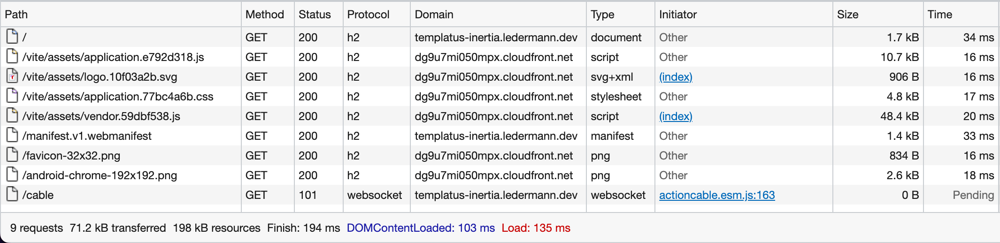

[](https://github.com/templatus/templatus-inertia/actions)
[](https://dashboard.cypress.io/projects/5d6bqs/runs)

# Templatus (Inertia edition)

Templatus is an opinionated template to build web applications with Ruby on Rails and Inertia (using Svelte.js). It simplifies the process of setting up a new application while following best practices.

Live demo available at https://templatus-inertia.ledermann.dev

There are two sister repositories:

Using Hotwire instead of Inertia (the "DHH way"):
https://github.com/templatus/templatus-hotwire/

Using API instead of Inertia and Svelte.js instead of Vue.js;
https://github.com/templatus/templatus/

## Features / Technology stack

### Backend

- [Ruby](https://www.ruby-lang.org/de/) 3.2
- [Ruby on Rails](https://rubyonrails.org/) 7.1
- [ActionCable](https://guides.rubyonrails.org/action_cable_overview.html) for WebSocket communication
- [PostgreSQL](https://www.postgresql.org/) for using as SQL database
- [Sidekiq](https://sidekiq.org/) for background processing
- [Redis](https://redis.io/) for Caching, ActionCable, and Sidekiq

### Frontend

- [Inertia](https://inertiajs.com/) as a protocol for frontend/backend communication
- [Tailwind CSS 3](https://tailwindcss.com/) to not have to write CSS at all
- [Tabler Icons](https://tabler-icons.io/) for free SVG icons
- [Vite](https://vitejs.dev/) for bundling JavaScript and CSS with Hot Module Replacement (HMR) in development

### Development

- [Puma-dev](https://github.com/puma/puma-dev) for using `.test` TLD (instead of `localhost:3000`) and `https` in development
- [Overmind](https://github.com/DarthSim/overmind) for starting up the application locally (Procfile handling like Foreman)
- [dotenv](https://github.com/bkeepers/dotenv) to load environment variables from .env into ENV
- [TypeScript](https://www.typescriptlang.org/) for writing strongly-typed JavaScript
- [Prettier](https://prettier.io/) for auto-formatting TypeScript and Ruby code in Visual Studio Code
- [annotate](https://github.com/ctran/annotate_models) for annotating models and routes

### Linting and testing

- [RuboCop](https://rubocop.org/) for Ruby static code analysis
- [RSpec](https://rspec.info/) for Ruby testing
- [ESLint](https://eslint.org/) for TypeScript static code analysis
- [Cypress](https://www.cypress.io/) for E2E testing

### Deployment

- [Docker](https://www.docker.com/) for production deployment, NOT for development
- [DockerRailsBase](https://github.com/ledermann/docker-rails-base) for fast building an optimized Docker image based on Alpine Linux
- [GitHub Actions](https://docs.github.com/en/actions) for testing, linting, and building Docker image
- [Dependabot](https://docs.github.com/en/code-security/supply-chain-security/keeping-your-dependencies-updated-automatically/about-dependabot-version-updates) configuration for updating dependencies (with auto-merge)
- Ready for serving assets via CDN like CloudFront
- [Honeybadger](https://www.honeybadger.io/) for error tracking in Ruby and TypeScript
- [Plausible](https://plausible.io/) for privacy friendly analytics

### Production

- [Lograge](https://github.com/roidrage/lograge) for single-line logging
- Gzip compression of dynamic responses (HTML, JSON) using [Rack::Deflater](https://github.com/rack/rack/blob/master/lib/rack/deflater.rb)
- Fine-tuned Content Security Policy (CSP)

## Metrics

This template is developed with optimized performance and security in mind. The following benchmarks are performed against the demo installation on production. It uses an inexpensive virtual server on the [Hetzner Cloud](https://www.hetzner.com/de/cloud) behind a [Traefik](https://traefik.io/traefik/) setup.

### Lighthouse site performance

100% in all categories.


### Security headers

[](https://securityheaders.com/?q=templatus-inertia.ledermann.dev&followRedirects=on)

What's the red _Permissions-Policy_ badge? This seems to be fixed with one of the next Rails update:
https://github.com/rails/rails/pull/41994

### Mozilla Observatory

[](https://observatory.mozilla.org/analyze/templatus-inertia.ledermann.dev)

### WebPageTest

[](https://www.webpagetest.org/result/220616_BiDcE2_4B7/)

### GTmetrix

[](https://gtmetrix.com/reports/templatus-inertia.ledermann.dev/UNRVxoRT/)

### Check-your-website

[](https://check-your-website.server-daten.de/?q=templatus-inertia.ledermann.dev)

### JavaScript size

176 KB of compiled JavaScript (after tree-shaking, minified & uncompressed).

```
$ RAILS_ENV=production bin/rails assets:precompile
yarn install v1.22.19
[1/6] 🔍  Validating package.json...
[2/6] 🔍  Resolving packages...
success Already up-to-date.
✨  Done in 0.11s.
Building with Vite ⚡️
vite v4.4.11 building for production...
transforming...
✓ 4980 modules transformed.
rendering chunks...
computing gzip size...
../../public/vite/manifest-assets.json               0.10 kB │ gzip:  0.09 kB
../../public/vite/assets/logo-10f03a2b.svg           0.50 kB │ gzip:  0.30 kB
../../public/vite/manifest.json                      0.57 kB │ gzip:  0.22 kB
../../public/vite/assets/application-e151bf91.css   21.46 kB │ gzip:  4.88 kB
../../public/vite/assets/application-eb9572d8.js    29.73 kB │ gzip: 11.17 kB │ map:  58.05 kB
../../public/vite/assets/vendor-597444d4.js        181.57 kB │ gzip: 61.41 kB │ map: 818.86 kB
✓ built in 21.26s
Build with Vite complete: /Users/ledermann/Projects/templatus-inertia/public/vite
```

### Network transfer

Small footprint: The demo application transfers only **71 KB** of data on the first visit.



### Docker build time

With multi-stage building and using [DockerRailsBase](https://github.com/ledermann/docker-rails-base) the build of the Docker image takes very little time. Currently, the `deploy` job requires about 1,5 minutes on GitHub Actions (see https://github.com/templatus/templatus-inertia/actions)

### Docker image size

The Docker image is based on Alpine Linux and is optimized for minimal size (currently **115 MB** uncompressed disk size). It includes just the bare minimum - no build tools like Node.js, no JS sources (just the compiled assets), no tests.

```
$ container-diff analyze ghcr.io/templatus/templatus-inertia -n

-----Size-----

Analysis for ghcr.io/templatus/templatus-inertia:
IMAGE                                 DIGEST     SIZE
ghcr.io/templatus/templatus-inertia   sha256:... 115M
```

## Getting started

### Install for development

1. Clone the repo locally:

```bash
git clone git@github.com:templatus/templatus-inertia.git
cd templatus-inertia
```

2. Install PostgreSQL, Redis, and puma-dev (if not already present). On a Mac with Homebrew, run this to install from the `Brewfile`:

```bash
brew bundle
```

3. Set up [puma-dev](https://github.com/puma/puma-dev) to use HTTPS for development. Do this on macOS:

```bash
sudo puma-dev -setup
puma-dev -install
puma-dev link

# Use Vite via puma-dev proxy
# Adopted from https://github.com/puma/puma-dev#webpack-dev-server
echo 3036 > ~/.puma-dev/vite.templatus-inertia
```

4. Setup the application to install gems and NPM packages and create the database:

```bash
bin/setup
```

5. Start the application locally:

```bash
bin/dev
```

Then open https://templatus-inertia.test in your browser.

### Running linters

RuboCop:

```
bin/rubocop
```

ESLint:

```
bin/yarn lint
```

TypeScript compiler:

```
bin/yarn tsc
```

### Running tests locally

Ruby tests:

```
bin/rspec
open coverage/index.html
```

JavaScript unit tests:

```
bin/yarn test
```

E2E tests with Cypress:

```
bin/cypress open
```

This opens Cypress and starts Rails in `development` environment, but with `CYPRESS=true`, so the `test` database is used. This allows code editing without class reloading and recompiling assets.

To run Cypress in headless mode:

```
bin/cypress run
```

### Test deployment locally

```
docker network create public
docker-compose up
```
